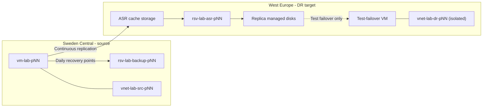

# Workshop 1: Azure Backup and Disaster Recovery

All exercises are Azure-to-Azure and run inside isolated, disposable Azure lab networks; no customer-network connectivity is required. You work in your own Azure subscription. The **source region is Sweden Central** and the **disaster-recovery target region is West Europe** (Azure Site Recovery requires the source and target regions to be different).

Across four labs you will protect an Azure VM with Azure Backup, recover a file, disks, and the whole VM, run an isolated Site Recovery test failover, and practise day-2 monitoring and troubleshooting.

## Outcomes

By the end of this workshop, participants can:

- Explain the operational difference between backup, high availability, and disaster recovery.
- Protect an Azure VM with a Recovery Services vault and an appropriate policy.
- Recover files, disks, and a VM, then validate the result.
- Run and clean up an isolated Azure Site Recovery test failover.
- Select recovery points based on RPO and RTO requirements.
- Monitor protection health, investigate failures, and escalate with useful evidence.

## Schedule

| Time | Activity |
|---|---|
| 09:00-10:00 | Foundations and architecture decisions |
| 10:00-11:00 | Lab 1: Configure Azure VM backup |
| 11:00-12:00 | Lab 2: Perform recovery operations |
| 12:00-13:00 | Lunch |
| 13:00-14:30 | Lab 3: Run an isolated Site Recovery drill |
| 14:30-15:30 | Lab 4: Day-2 operations |
| 15:30-16:00 | Review and cleanup |

## Cost and Soft Delete — Read This First

The customer requirement is to avoid surprise cost, especially from soft delete. Here is the accurate, Microsoft-Learn-aligned position that these labs are built on:

- **Soft delete can no longer be turned off** on a Recovery Services vault. New vaults are created with soft delete **Always-on** and a 14-day retention. This is enforced by Azure for all public regions (including Sweden Central) and is *not* something the facilitator can or should try to disable.
- **Soft delete at the default 14-day retention costs nothing.** Microsoft Learn: *"There's no retention cost for the default soft-delete duration of 14 days for vaulted backups."* Charges only begin if retention is extended **beyond** 14 days.
- Therefore the cost-control rules for this workshop are:
  1. **Never extend soft-delete retention** above the default 14 days.
  2. Use **Locally-redundant (LRS)** backup storage and a **short backup policy retention (7 days)** so the small amount of *active* backup storage is minimal.
  3. The real cost drivers are the **VMs, managed disks, Site Recovery replicated disks, and the replication cache storage account** — deallocate or delete these promptly, not the soft-deleted backup metadata.
  4. At cleanup, deleting a protected item moves it to a soft-deleted state (free for 14 days) and then auto-purges. Azure CLI 2.75+ / the portal also let you delete the whole vault while it only contains soft-deleted items; the vault then auto-purges for free. No manual "undelete then purge" dance is required, and nothing here incurs charges.

## Architecture

## Naming Convention

Replace `NN` with your participant number (`01`–`07`). All names are lowercase. Because each participant works in their **own subscription**, these identical names are intentional — the `pNN` suffix keeps facilitation, screenshots, and cleanup consistent across the seven subscriptions and makes it obvious which subscription a resource belongs to. The identical network address ranges are safe because the networks are isolated and never peered.

| Resource | Name | Region |
|---|---|---|
| Source resource group | `rg-lab-backup-pNN` | Sweden Central |
| Restore staging resource group | `rg-lab-restore-pNN` | Sweden Central |
| DR (target) resource group | `rg-lab-dr-pNN` | West Europe |
| Source virtual network | `vnet-lab-src-pNN` (`10.10.0.0/24`, subnet `snet-workload` `10.10.0.0/26`) | Sweden Central |
| DR test virtual network | `vnet-lab-dr-pNN` (`10.20.0.0/24`, subnet `snet-workload` `10.20.0.0/26`) | West Europe |
| Network security group | `nsg-lab-pNN` (no inbound rules; management uses portal **Run command**) | Sweden Central |
| Source VM | `vm-lab-pNN` (Windows Server 2022 Datacenter: Azure Edition, `Standard_B2as_v2`, no public IP) | Sweden Central |
| Backup Recovery Services vault | `rsv-lab-backup-pNN` (LRS, cross-region restore off) | Sweden Central |
| Backup policy | `pol-lab-vm-daily` (daily, 7-day retention) | Sweden Central |
| Site Recovery vault | `rsv-lab-asr-pNN` | West Europe |
| Log Analytics workspace | `log-lab-pNN` | Sweden Central |
| Action group | `ag-lab-pNN` | Global |

> **Why portal Run command instead of RDP/Bastion?** It needs no public IP, no inbound port 445/3389, and no Azure Bastion, so it is both cheaper and more secure. It also works against a *restored* VM, which is exactly what you need to validate recovery. Participants who prefer an interactive session can ask the facilitator to attach the shared Bastion, but it is not required for any task.

## Lab 1: Configure Azure VM Backup

**Time:** 60 minutes  
**Purpose:** Create a vault and policy, protect a VM, and interpret the first job.

Your source VM `vm-lab-pNN` and its backup vault were pre-staged by the facilitator, and a first recovery point already exists. In this lab you re-create the protection configuration yourself on the same VM to learn each decision, then trigger an on-demand backup and read the job.

### Task 1: Inspect the workload

1. In the [Azure portal](https://portal.azure.com), open **Resource groups** > `rg-lab-backup-pNN` > `vm-lab-pNN`.
2. On the **Overview** blade, record: **Location** (should be `Sweden Central`), **Operating system** (`Windows`), **Size** (`Standard_B2as_v2`), and **Status**.
3. Open **Disks** and record the OS disk name `vm-lab-pNN-osdisk` and its SKU. Confirm there is no temporary disk in use for lab data.
4. Confirm there are **no resource locks** that would block backup or cleanup:
   1. In the `vm-lab-pNN` left menu, scroll to the **Settings** group and select **Locks**.
   2. Confirm the list is **empty** ("No locks" / no rows). An empty list means the VM has no lock of its own.
   3. Locks are **inherited** from parent scopes, so also check the resource group: open **Resource groups** > `rg-lab-backup-pNN` > **Settings** > **Locks** and confirm that list is empty too. (To be thorough you can repeat at the subscription: **Subscriptions** > your subscription > **Settings** > **Resource locks**.)
   4. If any lock is listed, read its **Lock type** column. A **Read-only** lock stops you configuring backup; a **Delete** lock stops cleanup. Either one must be removed for this lab.
   5. To remove a lock (only if you own the scope): select the lock's **⋯** (or the row) and choose **Delete**, then confirm. If you cannot remove it, stop and tell the facilitator.

   > Optional check from **Cloud Shell** (PowerShell or Bash): `az lock list --resource-group rg-lab-backup-pNN -o table`. An empty result means there are no locks on the resource group or on the VM inside it.
5. Create the marker file without signing in to the VM:
   1. Download the script: [create-recovery-marker.ps1](scripts/create-recovery-marker.ps1).
   2. In `vm-lab-pNN`, select **Operations** > **Run command** > **RunPowerShellScript**.
   3. Open the downloaded file, copy its full contents into the command box, and select **Run**. The script detects your `pNN` automatically, creates `C:\LabData\recovery-marker.txt`, and prints it back.
6. Confirm the command output shows the timestamp and `team=pNN`.

**Checkpoint:** `C:\LabData\recovery-marker.txt` exists on the OS disk and its contents are recorded in your evidence sheet.

### Task 2: Review the vault

The vault `rsv-lab-backup-pNN` already exists in `rg-lab-backup-pNN`. You will inspect its security posture rather than create a new one.

1. Open **Resource groups** > `rg-lab-backup-pNN` > `rsv-lab-backup-pNN`.
2. Under **Settings** > **Properties**, find **Backup Configuration** and select **Update**. Confirm **Storage replication type** is **Locally-redundant (LRS)**. (This can only be changed before the first backup; leave it as is.)
3. In that same **Backup Configuration** pane, notice that **Cross Region Restore** is **greyed out / not available** — it only applies to **Geo-redundant (GRS)** storage, and this vault is LRS. That is expected for these labs; do **not** switch to GRS. Close the pane without saving.
4. Under **Properties** > **Security Settings**, note that **Soft Delete** is **Enabled (Always-on)** with **14 days** retention and cannot be turned off. Do **not** increase the retention — that is the only setting that would add cost.

**Checkpoint:** You can state which vault settings are cost-relevant (storage redundancy, soft-delete retention) and which are irreversible after the first backup (storage redundancy).

### Task 3: Configure protection and run an on-demand backup

1. In `rsv-lab-backup-pNN`, select **Backup** (under **Getting started** or **Protected items**).
2. Set **Datasource type** = **Azure Virtual machines** and **Where is the workload running?** = **Azure**. Select **Continue / Backup**.
3. Under **Backup policy**, choose **Create a new policy** and configure:
   - **Policy name:** `pol-lab-vm-daily`
   - **Backup schedule:** **Daily**, time any value, time zone **UTC**
   - **Instant Restore:** snapshot retention **1 day** (lowest, to reduce snapshot cost)
   - **Retention of daily backup point:** **7 days**
   - Leave weekly/monthly/yearly retention **disabled**.
4. Under **Virtual Machines** > **Add**, select `vm-lab-pNN` and choose **OK**, then **Enable backup**. Watch the deployment notification succeed.
5. Open **rsv-lab-backup-pNN** > **Backup items** > **Azure Virtual Machine** > `vm-lab-pNN`. Select **Backup now**.
6. In the **Backup now** pane, accept the default **Retain backup till** date (7 days out) and select **OK**. Do not extend it.
7. Open **Backup center** or the vault's **Backup jobs**, then open the running job. Expand the phases (**Take Snapshot**, **Transfer data to vault**) and note that a first recovery point may take 20–60 minutes.

**Pass criteria:**

- `vm-lab-pNN` appears under **Backup items** with policy `pol-lab-vm-daily`.
- The on-demand job starts without an authorization or `RequestDisallowedByPolicy` error.
- You can point to the pre-staged recovery point that Lab 2 will use, and explain that the on-demand job you just started will only be needed if you want a fresher point.

> The on-demand backup may not finish inside the lab slot. Lab 2 uses the recovery point that the facilitator pre-staged at least 24 hours earlier.

## Lab 2: Perform Recovery Operations

**Time:** 60 minutes  
**Purpose:** Compare item-level recovery, disk recovery, and full VM recovery.

Use the pre-staged protected VM `vm-lab-pNN`. Work in pairs where possible: divide Task 1 and Task 2, then review together before Task 3.

### Task 1: Recover a single file (Item-Level Recovery)

1. Open `rsv-lab-backup-pNN` > **Backup items** > **Azure Virtual Machine** > `vm-lab-pNN`.
2. Select **File Recovery**.
3. Under **Step 1**, choose the pre-staged recovery point (note its UTC timestamp on your evidence sheet).
4. Under **Step 2**, select **Download Executable** to download the iSCSI mount script, and copy the shown password.
5. Run the downloaded `.exe` on **your own workstation** (or a facilitator-provided jump machine) and paste the password when prompted. The script mounts the recovery point as a local volume and prints the drive letters.
6. Open the mounted volume, browse to `\LabData\`, and copy `recovery-marker.txt` to a local folder such as `C:\restore-pNN\`.
7. Open the restored copy and compare its timestamp/`team=pNN` value with the current marker you created in Lab 1.
8. Return to the portal **File Recovery** pane and select **Unmount Disks**. Confirm the script/session reports the disks are unmounted.

**Checkpoint:** The restored marker is readable, its recovery-point time is recorded, and the recovery disks are unmounted (leaving them mounted keeps a snapshot lease open).

### Task 2: Restore disks

1. In `vm-lab-pNN` backup item, select **Restore VM** > **Restore disks**.
2. Configure:
   - **Recovery point:** the pre-staged point.
   - **Resource group:** `rg-lab-restore-pNN`.
   - **Staging location (storage account):** the facilitator-provided staging storage account in `rg-lab-restore-pNN`, or create one named `stlabrestpNN` + a random suffix (StorageV2, LRS, Sweden Central).
3. Select **Restore** and monitor the job under **Backup jobs**.
4. When complete, open `rg-lab-restore-pNN` and inspect the restored managed disk(s) and the generated ARM template/scripts.
5. Note when **Restore disks** is preferable to **Create new VM** — for example when you must reattach to an existing VM, change VM size, or customize networking before boot.

### Task 3: Restore a full VM

1. In `vm-lab-pNN` backup item, select **Restore VM** > **Create new VM**.
2. Configure:
   - **Virtual machine name:** `vm-lab-pNN-r` (unique; must not clash with the source).
   - **Resource group:** `rg-lab-restore-pNN`.
   - **Virtual network:** `vnet-lab-src-pNN` **or** a facilitator restore network in `rg-lab-restore-pNN`.
   - **Subnet:** `snet-workload`.
   - Do **not** assign a public IP address.
3. Select **Restore** and monitor from **Backup jobs**.
4. When complete, open `vm-lab-pNN-r`:
   - Check **Boot diagnostics** > **Screenshot** shows the Windows sign-in screen.
   - Confirm **Status** is **Running** and it is on the expected subnet with no public IP.
   - Use **Operations** > **Run command** > **RunPowerShellScript** to read the marker file back and confirm it matches the selected recovery point.

**Pass criteria:** `vm-lab-pNN-r` is isolated (no public IP), starts successfully, and contains the expected marker from the selected recovery point.

## Lab 3: Run an Isolated Site Recovery Drill

**Time:** 90 minutes  
**Purpose:** Validate regional recovery to West Europe without affecting the source VM in Sweden Central.

Initial replication is pre-staged by the facilitator (it takes 30–60+ minutes and cannot be reliably completed inside the slot). Participants must not enable replication against production resources.

> Azure Site Recovery for Azure-to-Azure is set up in the portal (as below). The Site Recovery vault `rsv-lab-asr-pNN` lives in the **West Europe** target region.

### Task 1: Review replication health

1. Open `rg-lab-dr-pNN` > `rsv-lab-asr-pNN` > **Site Recovery** > **Replicated items**.
2. Confirm `vm-lab-pNN` shows **Status: Protected** and **Replication health: Healthy**.
3. Open the replicated item and record the latest **Crash-consistent** and **App-consistent** recovery-point timestamps.
4. Under **Compute and Network**, review the **Target VM size**, **Target resource group** `rg-lab-dr-pNN`, **Target network** `vnet-lab-dr-pNN`, **Target subnet** `snet-workload`, and target IP behavior.
5. Under the vault **Site Recovery infrastructure** > **Cache storage accounts** (or the replicated item's properties), note the ASR-managed cache storage account. Confirm it sits in the **source region (Sweden Central)** and source subscription, as required by ASR.

### Task 2: Validate isolation

1. Open `rg-lab-dr-pNN` > `vnet-lab-dr-pNN`.
2. Under **Peerings**, confirm there are **none**. Confirm there is no VPN gateway, ExpressRoute circuit, or shared private DNS zone link to any customer, production, or shared network.
3. Open `nsg-lab-pNN` (or the DR subnet NSG) and confirm inbound is restricted to the facilitator-approved validation path only (default: no inbound).
4. **Stop and escalate** if the network is not isolated. Do not run the failover until isolation is confirmed.

### Task 3: Run test failover

1. In `rsv-lab-asr-pNN` > **Replicated items**, select `vm-lab-pNN`, then **Test Failover**.
2. Choose **Latest processed (low RTO)** recovery point unless the scenario specifies another.
3. Set **Azure virtual network** = `vnet-lab-dr-pNN` (the isolated DR network).
4. Select **OK** and monitor **Site Recovery jobs** > **Test failover**.
5. Do **not** select **Failover** or **Commit** — those are real failovers and are out of scope.

### Task 4: Validate recovery

1. When the test failover completes, open `rg-lab-dr-pNN` and confirm a test VM named `vm-lab-pNN-test` exists and is **Running** in **West Europe**.
2. Check **Boot diagnostics** > **Screenshot** for the Windows sign-in screen.
3. Validate the guest via **Run command** > **RunPowerShellScript** by reading back the marker file.
4. Record the **measured RPO** = (test start time − selected recovery-point timestamp).
5. Record the **measured RTO** = (test start time → moment the marker check succeeded).

### Task 5: Clean up the drill

1. In the replicated item, select **Cleanup test failover**.
2. Tick **Testing is complete. Delete test failover virtual machine(s).** and add a note.
3. Select **OK** and confirm under **Site Recovery jobs** that the test VM and temporary NICs/disks are removed.
4. Confirm the replicated item is still **Protected / Healthy** — cleanup must not affect ongoing replication.

**Pass criteria:** The source `vm-lab-pNN` in Sweden Central stayed online, recovery validated in the isolated West Europe network, all test resources were removed, and replication remains healthy.

## Lab 4: Day-2 Operations

**Time:** 60 minutes  
**Purpose:** Detect protection gaps and produce actionable incident evidence.

### Task 1: Monitor protection

1. Open **Backup center** > **Overview**. Confirm the **Subscription** filter shows **your** subscription, then scope to your resource groups.
2. Under **Backup instances** and **Jobs**, find `vm-lab-pNN` and record its **Last backup status** and **latest restore point**.
3. Under **Backup center** > **Policy compliance** (or the vault **Backup items**), confirm `vm-lab-pNN` is compliant with `pol-lab-vm-daily`.
4. Open `rsv-lab-asr-pNN` > **Site Recovery** > **Replicated items** and record replication health and RPO for `vm-lab-pNN`.

### Task 2: Review notification routing

1. Open `ag-lab-pNN` (Azure Monitor **Action groups**) and review the email receiver configured by the facilitator.
2. In **Backup center** > **Alerts** (or **Monitor** > **Alerts**), review rules for **failed backup jobs**, **unhealthy backup instances**, and **Site Recovery replication health**.
3. Confirm severity, evaluation frequency, and the notification owner. Do **not** send test alerts to any production channel.

### Task 3: Triage a failure injection

The facilitator injects one reversible symptom into your environment — for example a resource lock on `rg-lab-restore-pNN`, a wrong DNS entry, a blocked NSG rule, or a supplied historic failed job.

1. Record the **correlation ID**, operation, UTC timestamp, resource, job step, and exact **error code**.
2. Classify the failure: control plane, data plane, guest, identity, capacity, or network.
3. Investigate using **Activity log**, the resource **Deployment/Activity** history, vault **Backup jobs** / **Site Recovery jobs**, **Resource health**, and relevant metrics.
4. Propose the **smallest safe remediation** (for example, remove the lock rather than recreate the resource).
5. State how you would verify protection has recovered (a successful on-demand backup or a healthy replication state).

**Pass criteria:** The team produces a concise incident note containing impact, evidence, likely cause, proposed action, owner, and verification step.

## Cleanup

Follow this order. None of these steps incur soft-delete charges because retention is the free default (14 days) and everything auto-purges.

1. Confirm every **test failover** was cleaned up in Lab 3 (`vm-lab-pNN-test` must not exist).
2. Delete restored resources once evidence is captured: `vm-lab-pNN-r`, restored disks, and any staging storage in `rg-lab-restore-pNN`.
3. **Disable Site Recovery replication:** in `rsv-lab-asr-pNN` > **Replicated items** > `vm-lab-pNN` > **Disable Replication** (choose the option that also removes ASR-created resources). This stops replicated-disk and cache-storage cost — the main DR cost driver.
4. **Stop VM backup:** in `rsv-lab-backup-pNN` > **Backup items** > `vm-lab-pNN` > **Stop backup** > **Delete backup data**. The item moves to a soft-deleted state (free, 14 days) and then auto-purges.
5. Delete the source `vm-lab-pNN` and its disks, then delete the three resource groups `rg-lab-backup-pNN`, `rg-lab-restore-pNN`, and `rg-lab-dr-pNN`. On Azure CLI 2.75+ / the portal, the vault can be deleted while it holds only soft-deleted items; it then auto-purges for free.
6. **Do not extend soft-delete retention** at any point — that is the only action that would turn free soft delete into a charge.

## Reference Links

- [Secure by default with soft delete for Azure Backup (why soft delete cannot be disabled, and pricing)](https://learn.microsoft.com/azure/backup/backup-azure-enhanced-soft-delete-about)
- [Back up an Azure VM from the VM settings](https://learn.microsoft.com/azure/backup/backup-azure-vms-first-look-arm)
- [Restore files from an Azure VM backup (Item-Level Recovery)](https://learn.microsoft.com/azure/backup/backup-azure-restore-files-from-vm)
- [Restore Azure VMs (disks and new VM)](https://learn.microsoft.com/azure/backup/backup-azure-arm-restore-vms)
- [Tutorial: Set up disaster recovery for Azure VMs (Azure-to-Azure)](https://learn.microsoft.com/azure/site-recovery/azure-to-azure-tutorial-enable-replication)
- [Tutorial: Run a disaster recovery drill (test failover)](https://learn.microsoft.com/azure/site-recovery/azure-to-azure-tutorial-dr-drill)
- [Azure VM backup support matrix](https://learn.microsoft.com/azure/backup/backup-support-matrix-iaas)
- [Azure-to-Azure Site Recovery support matrix](https://learn.microsoft.com/azure/site-recovery/azure-to-azure-support-matrix)